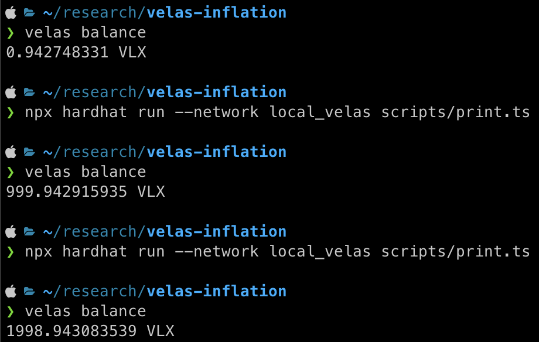

# PoC for the Velas infinite mint vulnerability

## Setup

1. Follow the instructions to get a local Velas chain running (with faucet):
https://github.com/velas/velas-chain

2. [Install](https://docs.velas.com/cli/install-velas-cli-tools) and configure the Velas CLI:
```
cp wallet.json ~/.config/velas/id.json
velas config set --url http://127.0.0.1:8899/
```

3. Airdrop yourself VLX
```
velas airdrop 1001002 GmbNPyEpYXgAz8Y7wi1Db3bycRePugTECU4DYPSRcfGN
```

4. Transfer 1mil VLX to null address.

    We do this because the deployed Velas chain starts with no VLX in the EVM space.
    
    And the bug is limited to stealing Native VLX in the amount that exists in the EVM space which is helf in "custody" by the [EVMState account](https://native.velas.com/address/EvmState11111111111111111111111111111111111) in Solana space. This account currently holds [26% of the total supply](https://native.velas.com/supply) of VLX, which is at the time of writing valued at $24mil (VLX=$0.04).

    This bug can also be used to mint an infinite amount of VLX in the EVM space.

```
velas evm transfer-to-evm 0x0000000000000000000000000000000000000000 1000000
```

4. Transfer 1001 VLX to your own EVM address
```
velas evm transfer-to-evm 0xf39Fd6e51aad88F6F4ce6aB8827279cffFb92266 1000
```

5. Your current VLX balance should be less than 1
```
velas balance
```


## Print money

1. Setup hardhat project
```
npm install
npx hardhat compile
```

2. Run the exploit
```
npx hardhat run --network local_velas scripts/print.ts
```



## Explanation

This bug is very similar to pwning.eth's [Aurora](https://medium.com/immunefi/aurora-infinite-spend-bugfix-review-6m-payout-e635d24273d) and [Moonbeam](https://pwning.mirror.xyz/okyEG4lahAuR81IMabYL5aUdvAsZ8cRCbYBXh8RHFuE) bugs.

It's caused by a [precompiled contract](https://github.com/velas/velas-chain/blob/031a0a1186c20d298f7472b7294db4ec19be3d82/evm-utils/programs/evm_loader/src/precompiles/builtins.rs#L98) not taking into account it can be called with delegatecall.

Velas blockchain is a combination of a Solana chain and an EVM chain. You can have VLX in "Solana space" aka "Native space", or in "EVM space".

When it in Native space, it's owned by your Native, Solana-type account.

And when it's in EVM space it belongs to an EVM address, while in the Native space is it hold in "custody" by the [EvmState11111111111111111111111111111111111](https://native.velas.com/address/EvmState11111111111111111111111111111111111) account.

The way to "bridge" VLX from the EVM space back to Native space is to send a transaction to a precompiled contract called `ETH_TO_VLX` at 

`0x56454c41532D434841494e000000000053574150`

Which has following interface:

```solidity
pragma solidity ^0.6.0;

interface TransferToNative {
  function transferToNative(bytes32 native_recipient) virtual external payable;
}
```

`native_recipient` is `32byte` address a Native account.

The PoC creates a smart contract which calls this precompiled contract with `DELEGATECALL` which doesn't actually send the VLX tokens to it, but it does transfer the corresponding amount of VLX to our Native space account.

This process can be repeated to steal all the VLX tokens owned by the EVMSTATE Native account, while also minting an infinite amount of VLX tokens in the EVM space.

Additional Reading:
* https://docs.velas.com/evm/
* https://github.com/velas/velas-chain/blob/0786046e53dea94478bc056ca5ecfd19e52e5f2e/evm-utils/architecture.md
